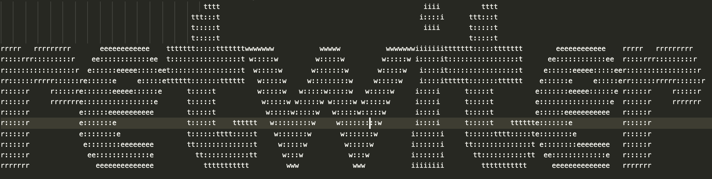

[![Contributors][contributors-shield]][contributors-url]
[![Forks][forks-shield]][forks-url]
[![Stargazers][stars-shield]][stars-url]
[![Issues][issues-shield]][issues-url]


<br />
<p align="center">
  <a href="https://github.com/venglas/retwiter">
    
  </a>

  <h3 align="center">Retwiter</h3>

  <p align="center">
    Retwiter is the node application that let you automatize retwitting posts.
    <br />
    <a href="https://github.com/venglas/retwiter/wiki"><strong>Explore the docs »</strong></a>
    <br />
    <br />
    ·
    <a href="https://github.com/venglas/retwiter/issues">Report Bug</a>
    ·
  </p>
</p>


## Table of Contents

* [About the Project](#about-the-project)
  * [Built With](#built-with)
* [Requirements](#prerequisites)
* [Installation](#installation)
* [Contributing](#contributing)

## About The Project
Retwiter is the node application that lets you automatize retwitting post from your account. The Retwiter application will get posts to retwitt from your following list. So you have to have at least one profile that you follow. You can run this application locally on your computer or on the VPS server.
Application has a log system - if you want to read more about this section or other features go to the documentation of this project -> [![Retwiter wiki][documentation-link]]

### Built With
* [Nodejs](https://nodejs.org/en/)
* [dotenv](https://www.npmjs.com/package/dotenv)
* [watchjs](https://www.npmjs.com/package/melanke-watchjs)
* [mongoose](https://mongoosejs.com/)
* [puppeteer](https://pptr.dev/)
* [winston](https://www.npmjs.com/package/winston)

### Requirements
* Node v14.10.0
* npm 6.14.8

### Installation

1. clone this repo
```sh
git clone https://github.com/venglas/retwiter.git
```
2. Install npm packages
```sh
npm i
```
3. If you have not installed mongo yet just run 
```sh
sh isntall-and-start-mongo.sh
```
4. For VPS server with Ubuntu 18.04 LTS you have to install mising packages
```sh
sh missing-ubuntu-packages.sh
```
5. Copy .env-template configuration file into project root and change name of the file to '.env'. Fill this file with your credentials. Description of this and other steps you can find in project wiki: [Retwiter wiki]([documentation-link])
6. Run application using node
```sh
node index.js
```

## Contributing

Contributions are what make the open source community such an amazing place to be learn, inspire, and create. Any contributions you make are **greatly appreciated**.

1. Fork the Project
2. Create your Feature Branch (`git checkout -b feature/AmazingFeature`)
3. Commit your Changes (`git commit -m 'Add some AmazingFeature'`)
4. Push to the Branch (`git push origin feature/AmazingFeature`)
5. Open a Pull Request


[contributors-shield]: https://img.shields.io/github/contributors/venglas/retwiter.svg?style=flat-square
[contributors-url]: https://github.com/venglas/retwiter/graphs/contributors
[forks-shield]: https://img.shields.io/github/forks/venglas/retwiter.svg?style=flat-square
[forks-url]: https://github.com/venglas/retwiter/network/members
[stars-shield]: https://img.shields.io/github/stars/venglas/retwiter.svg?style=flat-square
[stars-url]: https://github.com/venglas/retwiter/stargazers
[issues-shield]: https://img.shields.io/github/issues/venglas/retwiter.svg?style=flat-square
[issues-url]: https://github.com/venglas/retwiter/issues


[documentation-link]: https://github.com/venglas/retwiter/wiki