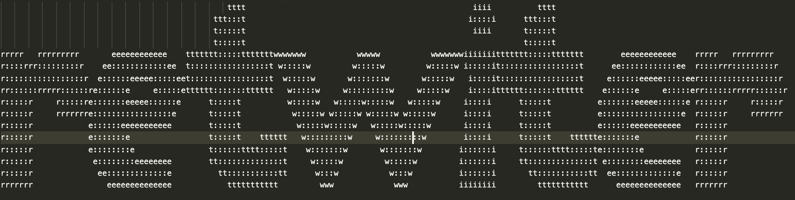
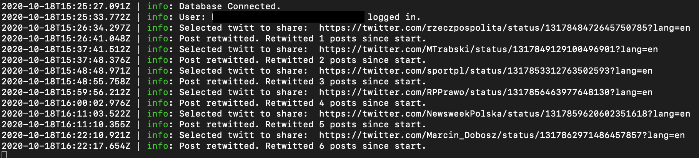

Retwiter will get posts from your home wall, so you have to follow profiles that you want to retwitt.

if you want to run this programm on vps server with ubuntu 18.04 lts you will need to install missing packages.
You can just run script that is in root directory of the project 
`missing-ubuntu-packages.sh`

database connection:
mongodb
.env -> DB_NAME= here u should set your database name
to install and configure db u need to run `install-and-start-mongo.sh`
then initiate your databse:
 * `mongo`
 * `use retwitter`
 * `db.user.insert({name: "test", age: 99})`
 last step is just add simple record to the database to finalize the initialization db process
 now u can check if your db was created corectly:
 `show dbs`

You have to see your databases like:
```
admin      0.000GB
config     0.000GB
local      0.000GB
retwitter  0.000GB
test       0.000GB
```
note: The database can be created automaticaly by the app on the first call to the mongo, but creating it with yourself is more safe.


Logs are autogenerated via winston
logfiles are stored in /logs
You can show whole log file with command `cat /logs/logs.log` or with specyfic number of latest lines like:
`tail -n 50 /logs/logs.log` - this will print last 50 logs lines
Command to show logs without log into the vps server:
> your computer have to be added as known_host in the vps server

ssh <your_ssh_alias> 'tail -n <number_of_last_lines_from_log> /root/projects/retwiter/logs/logs.log'
example ssh myVps 'tail -n 50 /root/projects/retwiter/logs/logs.log'
example for get errors ssh myVps 'tail -n 50 /root/projects/retwiter/logs/logs.log' | grep error

example of logs in app:


retwiter have simple preventing stop action, if app catch fatal error that can stop the application app will be restarted. This let the app working all the time on the vps without watching it.