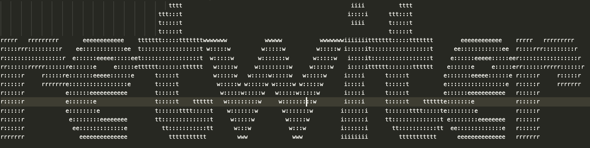

if you want to run this programm on vps server with ubuntu 18.04 lts you will need to install missing packages.
You can just run script that is in root directory of the project 
`missing-ubuntu-packages.sh`

database connection:
mongodb
.env -> DB_NAME= here u should set your database name
to install and configure db u need to run `install-and-start-mongo.sh`
then initiate your databse:
 * `mongo`
 * `use retwitter`
 * `db.user.insert({name: "test", age: 99})`
 last step is just add simple record to the database to finalize the initialization db process
 now u can check if your db was created corectly:
 `show dbs`

You have to see your databases like:
```
admin      0.000GB
config     0.000GB
local      0.000GB
retwitter  0.000GB
test       0.000GB
```